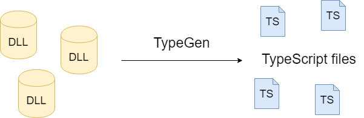
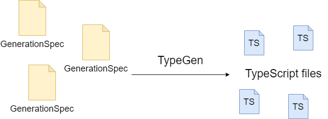

========
Overview
========

About TypeGen
=============

TypeGen is a command line tool that generates TypeScript sources from C# in a single-class-per-file manner. Its primary use case is keeping TypeScript model classes/interfaces in sync with C# models, and for this reason not all C# features are translated to TypeScript (e.g. methods or events will be ignored when generating TypeScript sources).

Requirements
============

For .NET Standard compatibility, see `compatibility table <https://docs.microsoft.com/en-us/dotnet/articles/standard/library>`_.

**Versions >= 2.0.0**

* CLI: .NET Core 2.1+ (.NET Core version for the CLI is updated whenever a new version of .NET Core is released)
* TypeGen.Core: .NET Standard versions: 1.3 and 2.0

**Versions 1.5.7 - 1.6.7**

* CLI: .NET Core 2.0
* TypeGen.Core: .NET Standard versions: 1.3 and 2.0

**Versions 1.5.0 - 1.5.6**

* CLI: .NET Framework 4.6
* TypeGen.Core: .NET Standard 1.3

**Versions <= 1.4.x**

.NET Framework 4.0

Features
========

Main TypeGen's features include:

* generating TypeScript classes, interfaces and enums - single class per file
* generating barrel (index) files
* support for collection (or nested collection) property types
* generic types generation
* support for inheritance
* customizable convertion between C#/TypeScript names (naming conventions)

Complete list of features added in each release is specified in the `changelog <http://jburzynski.net/TypeGen/changelog>`_.

How it works
============

TypeGen can be used in one of 2 ways:

1. By specifying :doc:`attributes <attributes>` on C# types you wish to generate. In this case, the big picture is illustrated on the diagram below:

In short, TypeGen gets selected C# types from one or more assemblies and generates corresponding TypeScript files for them in the file system.

Since TypeGen takes a .NET assembly, in theory it is also possible to provide an assembly written in a different language than C#. However, TypeGen is only tested with C# code.

2. By creating one or more :doc:`generation specs <generationspec>` (a generation spec is a C# class which specifies which types to generate).

In general, attributes offer quicker, but more functionally-restricted way of selecting types to generate, whereas generation specs require more initial work to do, but offer richer functionality.

Getting started
===============

After adding the `TypeGen NuGet package <https://www.nuget.org/packages/TypeGen>`_ to your project, TypeGen will be available in the Package Manager Console.

To use TypeGen as a .NET CLI tool (global), you can install it from `this package <https://nuget.org/packages/TypeGen.DotNetCli>`_.

Quick example
=============

Let's say you have a *ProductDto* class that you want to export to TypeScript.

1. If you're using attributes, just annotate your class with an appropriate attribute:

.. code-block:: csharp

    [ExportTsClass]
    public class ProductDto
    {
        public decimal Price { get; set; }
        public string[] Tags { get; set; }
    }
	
2. If you're using a generation spec, first create your generation spec somewhere in your project:

.. code-block:: csharp

    public class MyGenerationSpec : GenerationSpec
    {
        public MyGenerationSpec()
        {
            AddClass<ProductDto>();
        }
    }

...and then create a file named `tgconfig.json` directly in your project folder and place the following content in this file:

.. code-block:: json

    {
        "generationSpecs": ["MyGenerationSpec"]
    }

After finishing instructions described in either 1. or 2., **build your project** and type :code:`TypeGen generate` or :code:`TypeGen -p "MyProjectName" generate` (depending on the current working directory of the PM Console) into the Package Manager Console (you might have to restart Visual Studio). Instead of using the Package Manager Console, you can also use TypeGen as a .NET CLI tool by typing :code:`dotnet typegen generate` in your OS shell.

Performing the steps described above will generate a single TypeScript file (named *product-dto.ts*) in your project directory. The file will look like this:

.. code-block:: typescript

	export class ProductDto {
	    price: number;
	    tags: string[];
	}

To find out more about customization of various generation options, please visit the :doc:`CLI <cli>` section. You can also find out more about :doc:`attributes <attributes>` or :doc:`generation specs <generationspec>` in their dedicated sections.
